###### 
 Test-Driven Development (TDD) for Car and Track Project 

---
*This document contains an overview of the important tests for the Car, Section and Track classes as part of a Test-Driven Development (TDD) approach.*  
*Each test was written first and then the code was adjusted so that all tests were successful.*  

---
- # 1.) Important Additional Tests
  *To further validate the robustness and functionality of the program, the following tests can be implemented:*
  - ***Gear Transition Speed ​​Test***:
    > Checks whether the speed resets or adjusts correctly when the gear changes from high to low.
  - ***Test for consistency of the dice value***:
    > Checks whether rolling the dice always results in a number between 1 and 6 and that there are no exceptions or unexpected values.
  - ***Section Maximum Speed ​​Test***:
    > Verify that the car's speed does not exceed the maximum speed of a section.
  - ***Test for gear change exception***:
    > Checks whether ArgumentException is thrown correctly when invalid gear values ​​(e.g. above 6) are set.
  - ***Speed ​​test after multiple accelerations without changing gear***:
    > Checks whether the speed behaves consistently when 'Accelerate' is called up several times.

---
- # 2.) Tests for the Car class
   
  - ### ***ItShouldStandStill_GivenCreated***:
    > Ensures that the `Speed` of the car is 0, when created.
      
 
 $\color{lightgreen}{click\ for\ Screenshot}$ 

       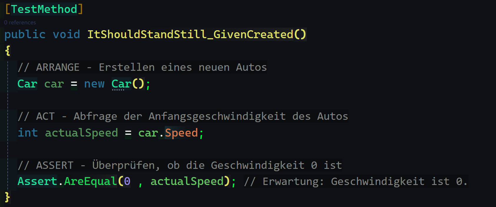
      

   
  - ### ***ItShouldStore_GivenGearBetweenOneAndSix***:
    > Ensures that a valid `Gear` is stored as expected.
      
 
 $\color{lightgreen}{click\ for\ Screenshot}$ 

       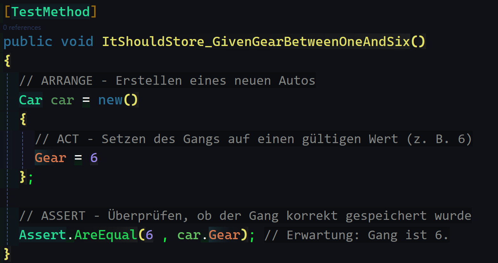
      

 
  - ### ***ItShouldThrowAnExpection_GivenGearOutsideRange***: 
    > Ensures that a `ExpectedException(typeof(ArgumentException)` is thrown, if an invalid `Gear` was set.
      
 
 $\color{lightgreen}{click\ for\ Screenshot}$ 

       
      

  - ### ***ItShouldHaveASpeedOfZero_GivenNoAcceleration***: 
    > Ensures that the `Speed` of a car is 0, if not accelerated.
      
 
 $\color{lightgreen}{click\ for\ Screenshot}$ 

       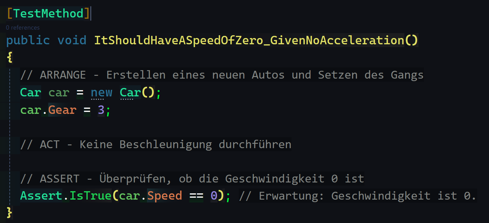
      

  - ### ***ItShouldHaveASpeedBetween30And180_GivenGear3AndAccelerated***: 
    > Ensures that `Accelerate()` works as intended, if a valid `Gear` was chosen and the new `Speed` of the car is in a valid range.
      
 
 $\color{lightgreen}{click\ for\ Screenshot}$ 

       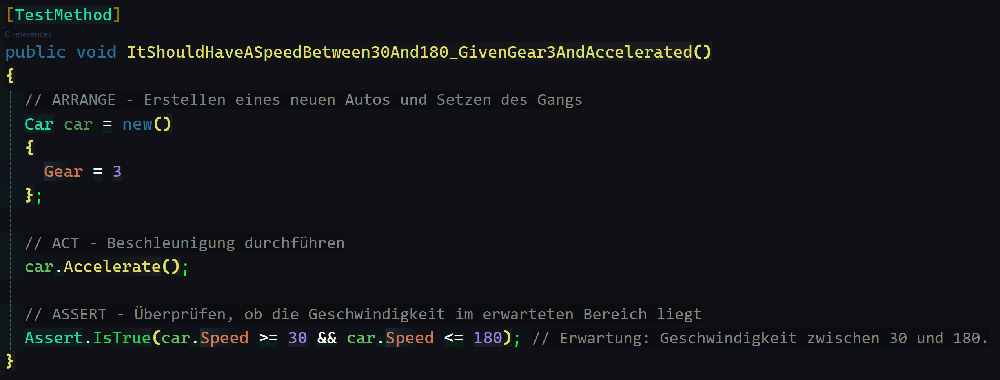
      

  - ### ***ItShouldHaveASpeedOf60_GivenGear3AndDiceShowsTwoDots***: 
    > Ensures that the Acceleration and `Speed` was computed correctly.
      
 
 $\color{lightgreen}{click\ for\ Screenshot}$ 

       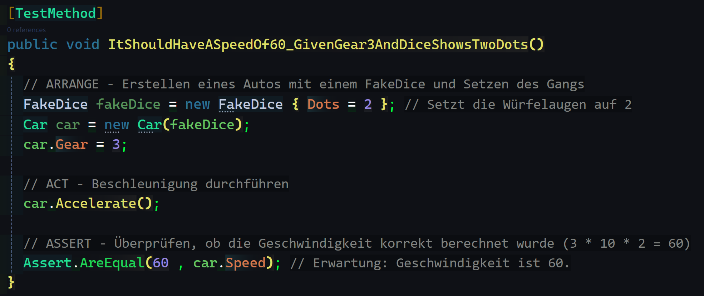
      

   
  - ### ***ItShouldCallDiceRoll_GivenAccelerateIsCalled***: 
    > Ensures that `Dice.RollWasCalled` is `true` if the car has accelerated.
      
 
 $\color{lightgreen}{click\ for\ Screenshot}$ 

       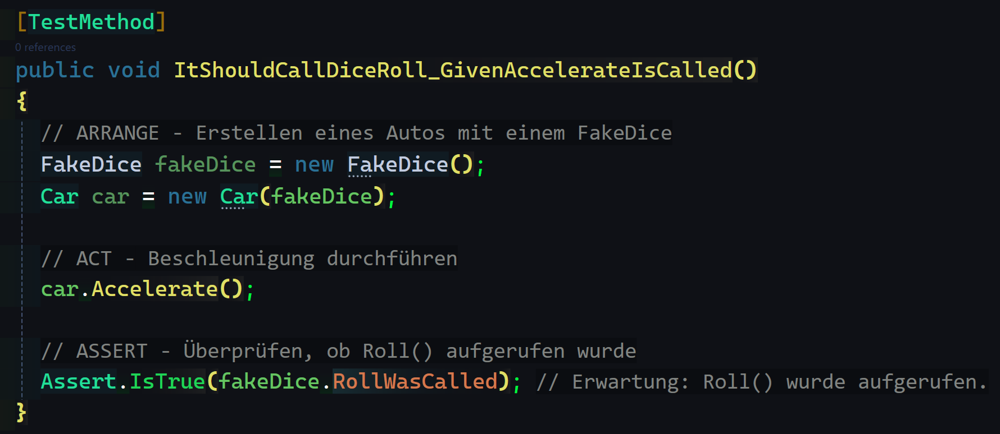
      

 
---
- # 3.) Tests for the Section class
  
  - ### ***ItShouldHaveALengthAndAMaxSpeed_GivenObjectCreated***:
    > Ensures that `MaxSpeed` ​​and `Length` are set correctly.
      
 
 $\color{green}{click\ for\ Screenshot}$ 

       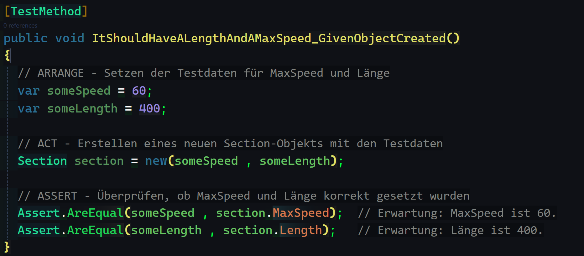
      

  - ### ***ItShouldConnectASectionAfterTheCurrentSection_GivenAddAfterMeIsCalled***:
    > Ensures that connecting Sections with `AddAfterMe()` works as expected.
      
 
 $\color{green}{click\ for\ Screenshot}$ 

       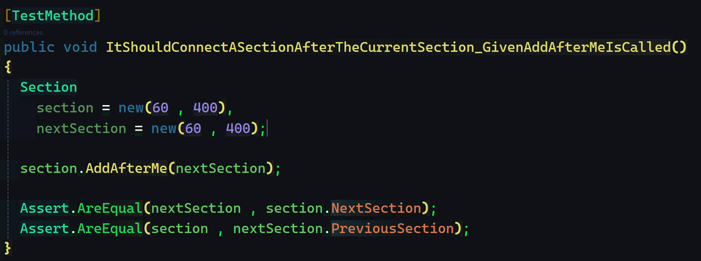
      

   - ### ***ItShouldConnectASectionBeforeTheCurrentSection_GivenAddBeforeMeIsCalled***:
     > Ensures that connecting Sections with `AddBeforeMe()` works as expected.
       
 
 $\color{green}{click\ for\ Screenshot}$ 

        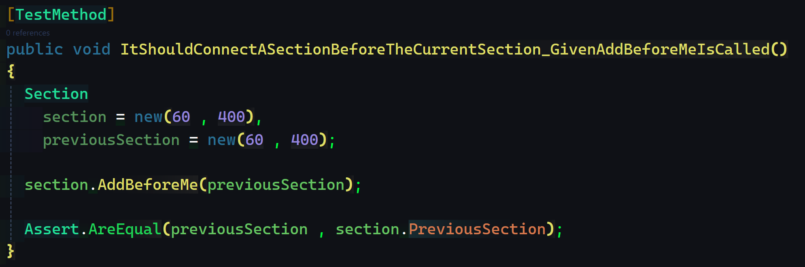
      

    - ### ***ItShouldInsertASectionBetweenTwoSections_GivenTwoConnectedSectionsAndAddAfterMeIsCalled***:
      > Ensures that connecting Sections with `AddAfterMe()` reconnects given Sections as expected.
       
 
 $\color{green}{click\ for\ Screenshot}$ 

        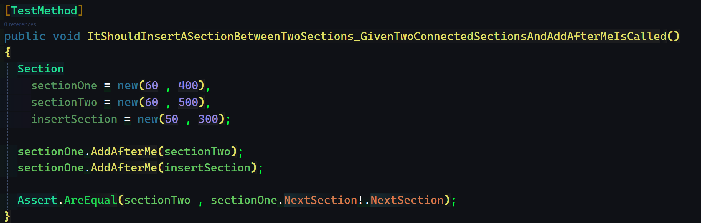
      

    - ### ***ItShouldInsertASectionBetweenTwoSections_GivenTwoConnectedSectionsAndAddbeforeMeIsCalled***:
      > Ensures that connecting Sections with `AddBeforeMe()` reconnects given Sections as expected.
        
 
 $\color{green}{click\ for\ Screenshot}$ 

         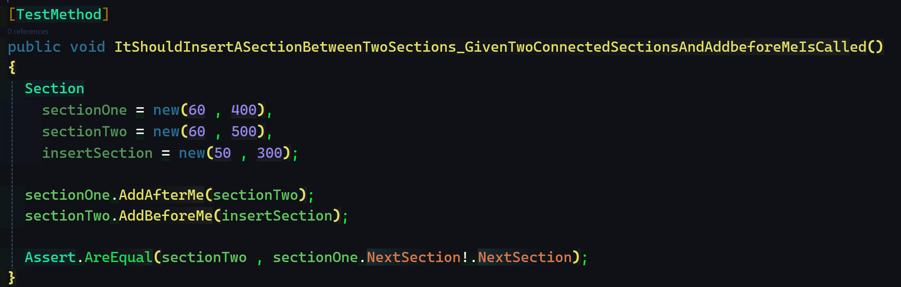
        

    
 - ## 3.1) Additional tests for Section
    - ***ItShouldThrowException_GivenNegativeMaxSpeed***:
      > Checks whether negative MaxSpeed ​​values ​​throw an exception.
     
    - ***ItShouldThrowException_GivenNegativeLength***:
      > Checks whether negative length values ​​throw an exception.
      
    - *Minimum Length Test* (***ItShouldThrowException_GivenLengthLessThanMinimum***):
      > Tests whether an exception is thrown if Length is too low.
      
    - *Limit for MaxSpeed* ​​(***ItShouldThrowException_GivenMaxSpeedExceedsLimit***):
      > Checks whether MaxSpeed ​​does not exceed the limit.

---
- # 4.) Tests for the Track class
    - ### ***ItShouldSaveTheStartSectionOfATrack_GivenAnyNumbersOfSections***:
      > Ensures that the `StartSection` gets saved by the track, as expected.
        
 
 $\color{lime}{click\ for\ Screenshot}$ 

         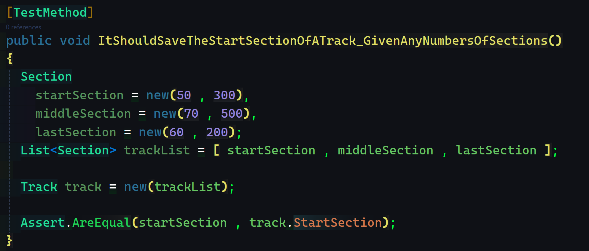
         

 - ## 4.1) Additional tests for Track 
      *If a track class contains multiple section instances, the following tests may be useful:*
 
    - ### ***ItShouldReturnTotalLength_GivenMultipleSections***:
      > Checks whether `GetTotalLength` calculates the correct total length of the sections.
        
 
 $\color{lime}{click\ for\ Screenshot}$ 

         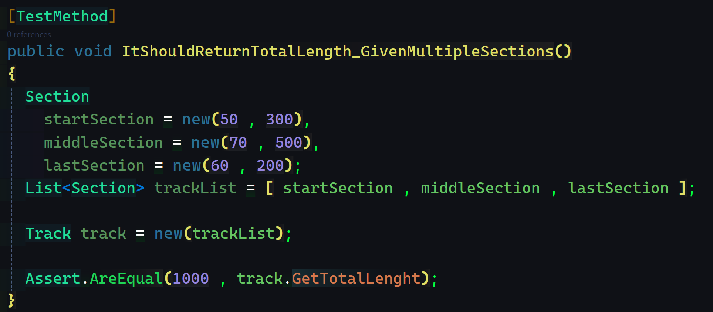
         

      
    - ### ***ItShouldReturnMaxSpeed_GivenMultipleSections***:
      > Checks whether `GetMaxSpeed` returns the highest allowed speed in the track.
        
 
 $\color{lime}{click\ for\ Screenshot}$ 

         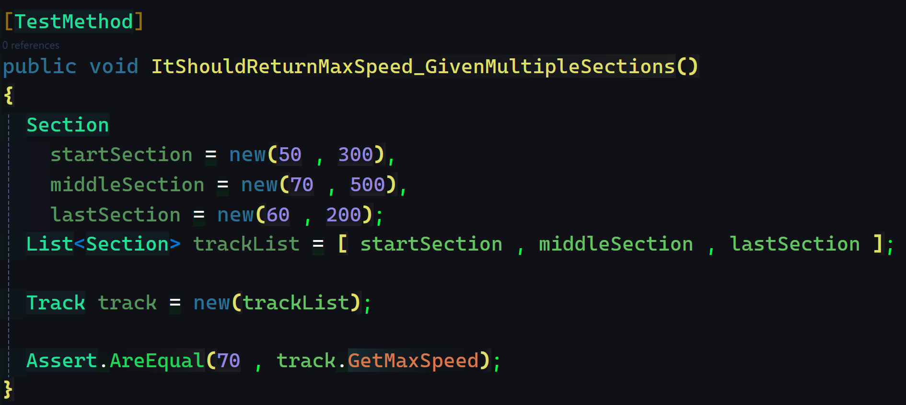
         

      
    - ### ***ItShouldThrowException_GivenEmptySectionList***:
      > Ensure an `exception is thrown` when track is created without sections.
        
 
 $\color{lime}{click\ for\ Screenshot}$ 

         
         

      
    - ### ***ItShouldThrowException_GivenNullSectionInList***:
      > Checks whether no `null` objects are accepted as a section.
        
 
 $\color{lime}{click\ for\ Screenshot}$ 

         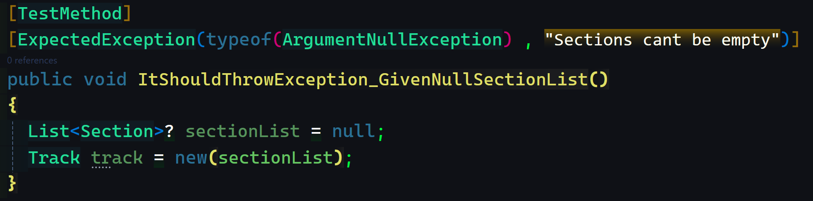
         

         
    - ### ***ItShouldConnectTheLastSegmentToTheFirst_GivenAnAdditionalParameterForALoopedTrack***:
      > Checks if a track is a looped track or not.
        
 
 $\color{lime}{click\ for\ Screenshot}$ 

         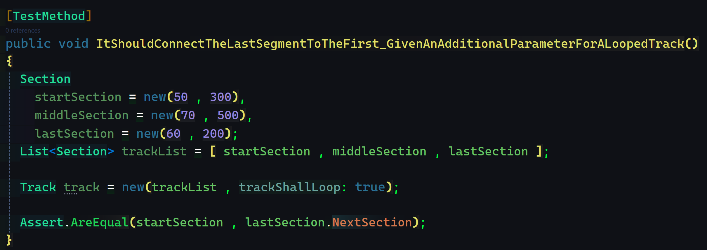
        

        
---
- # 5.) Tests for the TrackBuilder class
  
  - ### ***ItShouldBuildAConnectedTrack_GivenSectionInformation***:
    > Checks if the TrackBuilder builds (connects) a Track with given Sections as expected.
      
 
 $\color{yellow}{click\ for\ Screenshot}$ 

       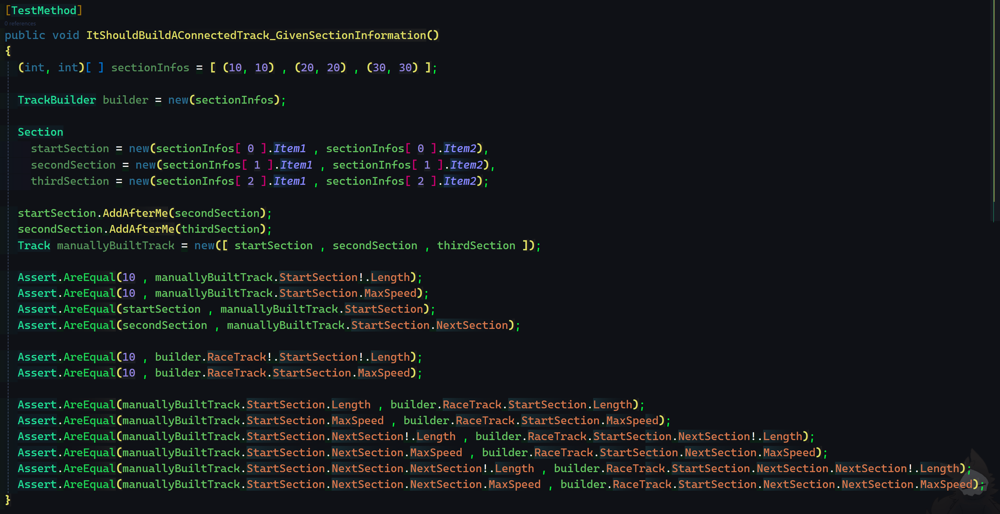
      

  - ### ***ItShouldConnectTheLastSegmentToTheFirst_GivenAnAdditionalParameterForALoopedTrack***:
    > Checks if a track is a looped track or not.
      
 
 $\color{yellow}{click\ for\ Screenshot}$ 

       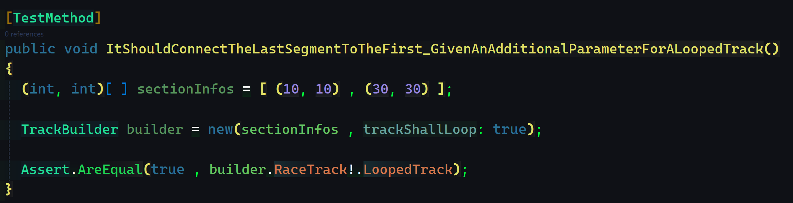
      

--- 
- # 6.) Summary
  *These tests cover the most important requirements and error conditions of the Car, Section and Track classes.*  
  *They validate the basic logic and robustness of the program and ensure that the application remains stable even with invalid inputs.*
